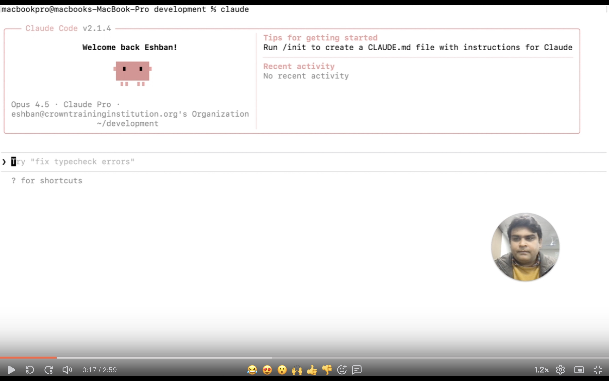

# 🎬 FFmpeg Video Scaling

**Scale videos efficiently without external dependencies**

Automate video resolution conversion from 1080p to lower resolutions (720p, 480p, 360p, 240p) using FFmpeg. Perfect for preparing videos for different platforms, devices, or bandwidth requirements.

---

## 🎥 Demo Video

**Building a Custom Claude Code Skill: Automated Video Downscaling with FFmpeg (Python)**  
▶️ Watch the demo:  
https://www.loom.com/share/7d8cf1dbadc4425d921f3d3490e7d166

---
## 🎥 Demo Video

[](https://www.loom.com/share/7d8cf1dbadc4425d921f3d3490e7d166)

_Click the image to watch the Loom demo._

---

## What It Does

✓ **Scales single videos** with one command  
✓ **Batch processes** multiple resolutions simultaneously  
✓ **Maintains aspect ratio** automatically  
✓ **Optimizes quality** vs file size with presets  
✓ **Zero Python dependencies** - pure subprocess calls  

---

## Use Cases

📱 **Mobile app video optimization** - Create optimized versions for mobile devices  
🌐 **Multi-bitrate streaming** - Prepare adaptive streaming packages  
💾 **Reduce file sizes** - Save storage space without quality loss  
🎥 **Quick previews** - Generate low-res previews instantly  

---

## Technologies

**Python** • **FFmpeg** • **Subprocess**

---

## 🚀 Quick Start

### Basic Usage

```bash
# Scale a video to 720p
python scripts/scale_video.py input.mp4 720p

# Creates: input_720p.mp4
```

### Custom Output Path

```bash
python scripts/scale_video.py input.mp4 480p output/mobile.mp4
```

### Quality Control

```bash
# Fast encoding, lower quality
python scripts/scale_video.py video.mp4 720p output.mp4 fast 28

# Slow encoding, high quality
python scripts/scale_video.py video.mp4 720p output.mp4 slow 18
```

---

## 📖 Documentation

### For Claude Code Users

Just tell Claude Code what you need:

```
"Scale my presentation.mp4 to 720p and 480p"
```

Claude will automatically use this skill to handle the conversion.

### Manual Usage

**Script Parameters:**
```bash
python scale_video.py <input> <resolution> [output_path] [preset] [crf]
```

| Parameter | Description | Default |
|-----------|-------------|---------|
| `input` | Input video file | Required |
| `resolution` | Target: 1080p, 720p, 480p, 360p, 240p | Required |
| `output_path` | Output file path | `{input_name}_{resolution}.mp4` |
| `preset` | Speed: ultrafast, fast, medium, slow | `medium` |
| `crf` | Quality: 0-51 (lower = better) | `23` |

### Available Resolutions

| Resolution | Dimensions | Best For |
|------------|------------|----------|
| **1080p** | 1920 × 1080 | HD displays, YouTube |
| **720p** | 1280 × 720 | Streaming, web |
| **480p** | 854 × 480 | Mobile, older devices |
| **360p** | 640 × 360 | Low bandwidth |
| **240p** | 426 × 240 | Previews, thumbnails |

---

## 💡 Quality Settings

### CRF Values (Constant Rate Factor)

Lower CRF = Better quality, larger files

- **18-20** - Near-lossless (archival)
- **23** - Default (recommended) ✓
- **28** - Smaller files (mobile)
- **32+** - Lowest quality (use sparingly)

### Encoding Presets

Faster = Less compression

- **ultrafast** - Quick previews
- **fast** - Good balance
- **medium** - Recommended ✓
- **slow** - Better compression
- **veryslow** - Maximum compression

---

## 📋 Examples

### Create mobile-optimized version
```bash
python scripts/scale_video.py training.mp4 480p mobile/training_mobile.mp4 medium 28
```

### Generate streaming package
```bash
# Create multiple resolutions for adaptive streaming
python scripts/scale_video.py source.mp4 1080p
python scripts/scale_video.py source.mp4 720p
python scripts/scale_video.py source.mp4 480p
python scripts/scale_video.py source.mp4 360p
```

### Quick low-res preview
```bash
python scripts/scale_video.py long_video.mp4 360p preview.mp4 ultrafast
```

### High-quality archival
```bash
python scripts/scale_video.py 4k_source.mp4 1080p archive.mp4 slow 18
```

---

## 🔧 Advanced Features

For advanced usage including:
- Hardware acceleration (NVIDIA, Intel, Apple)
- Two-pass encoding
- Custom filters (watermarks, crop, etc.)
- Batch processing with multiprocessing

See the [Advanced Techniques Guide](./references/advanced_techniques.md)

---

## 📁 What's Inside

```
ffmpeg-video-scaling/
├── SKILL.md                    # Main skill instructions for Claude Code
├── README.md                   # This file
├── scripts/
│   └── scale_video.py         # Main conversion script
└── references/
    ├── usage_guide.md         # Detailed usage guide
    └── advanced_techniques.md # Advanced FFmpeg techniques
```

---

## ⚙️ Requirements

**FFmpeg** must be installed on your system.

### Check Installation
```bash
ffmpeg -version
```

### Install FFmpeg

**macOS:**
```bash
brew install ffmpeg
```

**Ubuntu/Debian:**
```bash
sudo apt install ffmpeg
```

**Windows:**  
Download from [ffmpeg.org](https://ffmpeg.org/download.html)

---

## 🐛 Troubleshooting

**"ffmpeg: command not found"**  
→ Install FFmpeg using instructions above

**Slow encoding**  
→ Use faster preset: `fast` or `ultrafast`  
→ Or enable hardware acceleration (see Advanced Guide)

**Poor quality output**  
→ Lower CRF value (try `20` instead of `23`)  
→ Use slower preset (`slow` or `slower`)

**Large file sizes**  
→ Increase CRF value (try `28` instead of `23`)  
→ Use lower resolution

---

## 📊 Performance

**Typical Processing Times** (1-hour 1080p video on MacBook Pro M1):

| Target | Preset | Approximate Time |
|--------|--------|------------------|
| 720p | ultrafast | ~2 minutes |
| 720p | medium | ~8 minutes |
| 720p | slow | ~15 minutes |
| 480p | medium | ~5 minutes |
| 360p | fast | ~2 minutes |

*Note: Hardware acceleration can reduce these times by 5-10x*

---

## 📄 License

MIT License - Use freely in your projects

---

## 🤝 Feedback

Found a bug or have a suggestion?  
[Open an issue](https://github.com/eshbanbahadur/agentic-ai-portfolio/issues) or connect on [LinkedIn](https://www.linkedin.com/in/eshban/)

---

## 🔗 Related Skills

*More skills coming soon!*

- **PDF Automation** - Extract, merge, split PDFs *(in development)*
- **Image Processing** - Batch resize, compress, watermark *(planned)*

---

<p align="center">
  <sub>Built with ❤️ by <a href="https://github.com/eshbanbahadur">Eshban Bahadur</a></sub><br>
  <sub>Part of the <a href="https://github.com/eshbanbahadur/agentic-ai-portfolio">Agentic AI Portfolio</a></sub>
</p>
